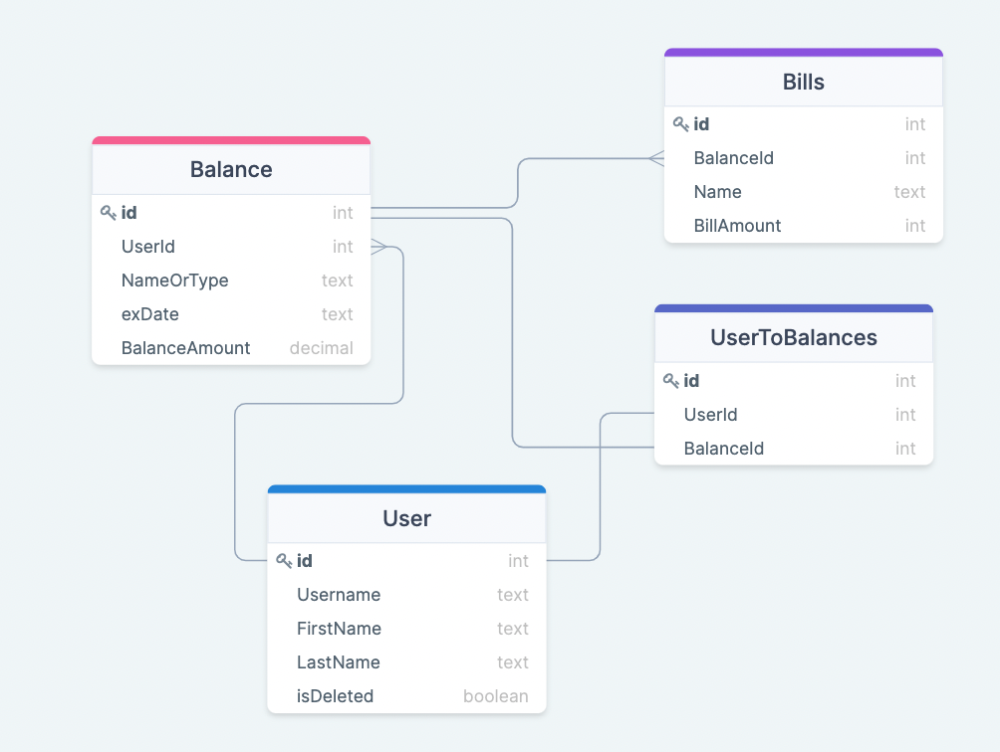
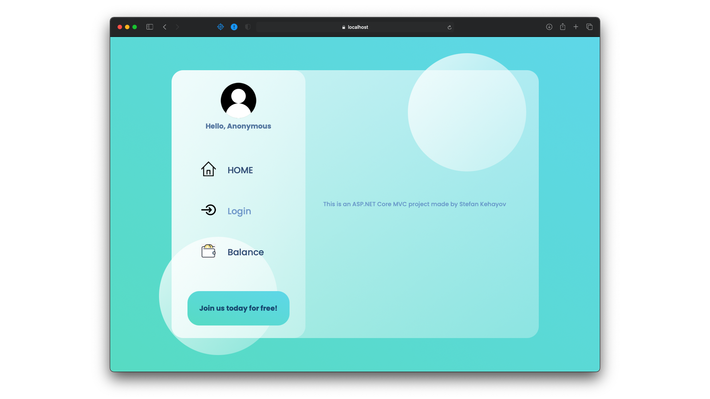
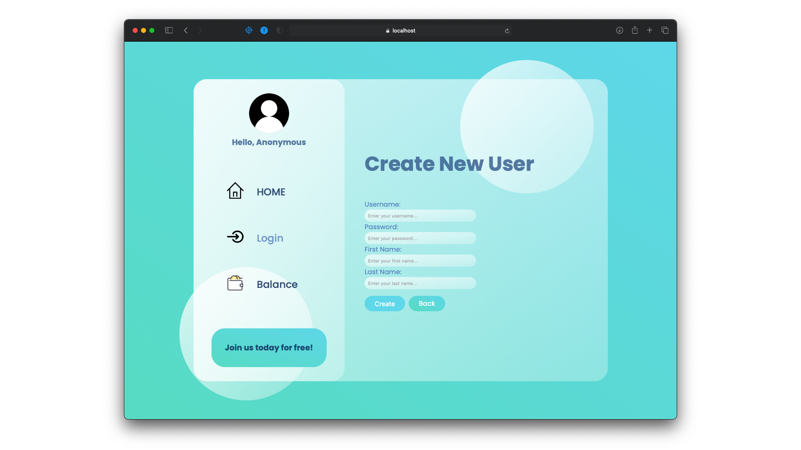
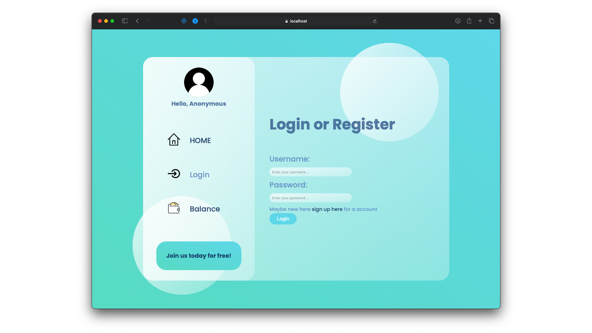
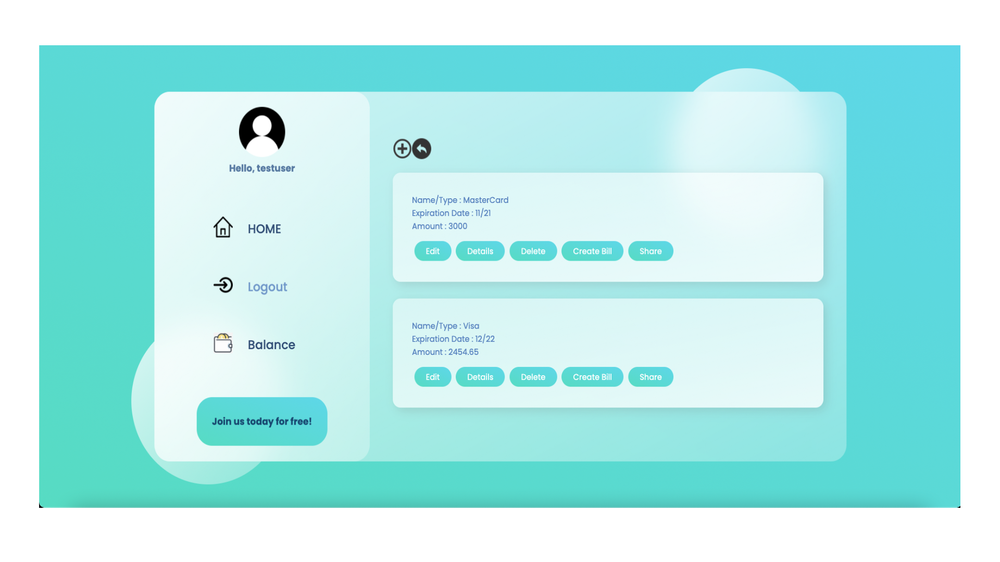
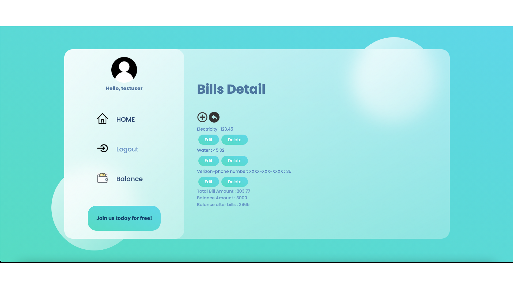

# Balance App Project

The project represent the need of tracking your money more exactly your bills.You can specify your budget by creating your balance(Debit Cards,Credit Cards..) and 
creating the bills for this balance. The back end part uses .NET 6 and the front end uses MVC. Also this project uses GitHub Actions for CI.

# Database schema

# Images of the website

